<h2 align="left">Hi 👋! My name is Sehyeong Yeom and I'm a Computer Science major at Purdue University</h2>

###

  
  

###

###

  
  
  
  
  
  
  
  
  
  
  
  
  

###

  
  
  
  

###

 

###
